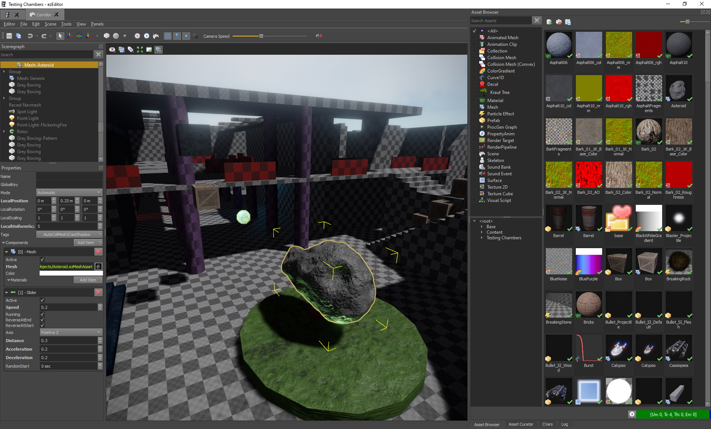

# ezEditor Overview

<!-- TODO: This page needs a lot more information -->

ezEditor is the central application for authoring content and bringing existing assets together. It includes a scene editor, functionality for working with [meshes (TODO)](../graphics/meshes-overview.md), [textures (TODO)](../graphics/textures-overview.md), [materials (TODO)](../materials/materials-overview.md), [particles](../effects/particle-effects/particle-effects-overview.md) and [sounds (TODO)](../sound/sound-overview.md), as well as a [visual shader editor (TODO)](../materials/visual-shaders.md), [visual scripting (TODO)](../custom-code/visual-script/visual-script-overview.md) and [prefabs (TODO)](../prefabs/prefabs-overview.md). The editor transforms [assets (TODO)](../assets/assets-overview.md) from source data into the optimized runtime formats and keeps track which assets are up to date.

The editor can also [run the game logic](run-scene.md) inside the viewport while making edits, or start a complete play-the-game mode which lets you experience your creation without delay.

The runtime functionality of the editor lives in a separate engine process, which makes the editor very robust. If the engine crashes, the editor can just relaunch it within a second, without loss of work and with minimal interruption.

## Compiling the Editor

The editor currently only builds on Windows and requires Qt. See [Building ezEngine](../build/building-ez.md).

## Sample Projects

See [Testing Chambers](../samples/testing-chambers.md).

## Setting Up a Custom Project

When you create a custom [project](../projects/projects-overview.md), you must make a few configurations.

Select *Editor > Create Project* and select an empty folder where your project should be stored.

Now select *Editor > Project Settings > Data Directories*. Click the button to add another folder. By default *:sdk/Data/Base* should already be included, because this folder contains all crucial shaders and materials for scene editing. You may want to add additional folders, such as the *Data/Content* folder.

After closing and reopening the project you are good to go to create your first scene: *Editor > Create Document > MyFirst.ezScene*

## Importing Assets

ezEngine represents assets with a dedicated [document (TODO)](editor-documents.md) on the editor side. Typically to get e.g. a texture into the engine, you need to go to *Editor > Create Document* and choose *Texture Asset*. Then fill out the document properties to point to your source asset (e.g. a DDS or TGA file).

For common asset types (e.g. meshes and textures) you can automate parts of the process by selecting *Editor > Import Assets* and then browse for one or multiple source asset files. The following steps will automatically execute the basic steps, which saves a lot of time.

## See Also

* [Back to Index](../index.md)
* [Samples](../samples/samples-overview.md)
* [Videos](../appendix/videos.md)
