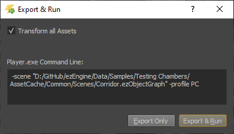

# Running a Scene

When you have a scene open in the editor, there are multiple ways how you can test it.

## Simulate Mode

The *Simulate Mode* is activated with the *Play* button in the toolbar or by pressing the `F5` key. It is deactivated with the *Stop* button or by pressing `Shift+F5`.

This enables the simulation of all game objects inside the editor. You can still select objects, modify their properties and move and rotate most of them. However, since at that point the simulation actively modifies the state of objects, some things will not work. For example, physically simulated objects and other objects that actively modify their position may not react to transform changes as expected. Similarly, modifying properties may not have an effect, if the components in question don't reevaluate those properties during simulation.

Some objects will also be spawned by the simulation, and therefore are unknown to the editor side. Those objects cannot be picked or modified.

In general, modifying the scene during simulation will work for some objects, and won't work for others. The only way to find out, is to try it. Once the simulation is stopped, though, all modifications will be applied as expected, to the reset scene.

This mode is useful to quickly check how some object behaves. It can also be used to simulate physical objects (e.g. boxes falling down) and then to save that simulated transform to the scene, by selecting them and pressing `K` (or *Scene > Utilities > Keep Simulation Changes*).

## Play the Game Mode

The *Play-the-Game Mode* (PTG) is activated with the *Controller* button in the toolbar or by pressing `CTRL+F5`. It is deactivated with the *Stop* button in the editor toolbar, by pressing `ESC` while the PTG window has focus.

This enables the simulation, similar to the *Simulate Mode*. However, it additionally activates the [Game State (TODO)](../runtime/application/game-state.md). Therefore this mode spawns a separate window and also routes all [input (TODO)](../input/input-overview.md) to the running game. If the scene contains a [Player Start Point component](../gameplay/player-start-point.md) the game state may spawn the referenced prefab and thus enable you to properly play the game.

You can `Alt+Tab` out of the PTG window, back to the editor, and modify the scene the same way as in the simulate mode, with the same restrictions.

This mode is useful to quickly run the game with full input. Note that, because it is running from the editor process, its framerate is limited. For maximum performance you need to [Export and Run](#export-and-run) the scene.

### Play From Here

If the scene contains a [Player Start Point component](../gameplay/player-start-point.md), then you can right click in the scene and select *Play From Here*. This starts *Play-the-Game* and spawns the player prefab at the desired position. This makes it quick and easy to try out a feature in the scene, without having to move the player start position.

## Export and Run

Another way to test the scene is to export it to a binary format and run it in the [ezPlayer](../tools/player.md). You do so using *Scene > Export and Run...* or by pressing `CTRL+E`.

If you keep `Transform all Assets` checked, all [assets](../assets/assets-overview.md) in the project will be *transformed* first, making sure they are up-to-date. You can uncheck this, to speed up the process, if you know that all assets that you require are up-to-date already.

Both *Simulate Mode* and *Play-the-Game Mode* run inside the editor process. Compared to a game running in a stand-alone process this has two drawbacks:

1. The editor process limits the maximum framerate, and has some performance overhead of its own, so this is not useful for performance testing.
1. All component properties are initialized from the values as the editor has saved them. This is not the (optimized) binary serialization that is used for a final game. Since the binary serialization code has to be written manually, it can happen that properties that are exposed in the editor and work fine there, have been forgotten to be included in the binary serialization and therefore have no effect in the final game. Therefore, always make sure to test [custom components](../runtime/world/components.md) properly with exported scenes.

## See Also

* [Back to Index](../index.md)
* [ezPlayer](../tools/player.md)
* [Game States (TODO)](../runtime/application/game-state.md)
* [Player Start Point](../gameplay/player-start-point.md)
