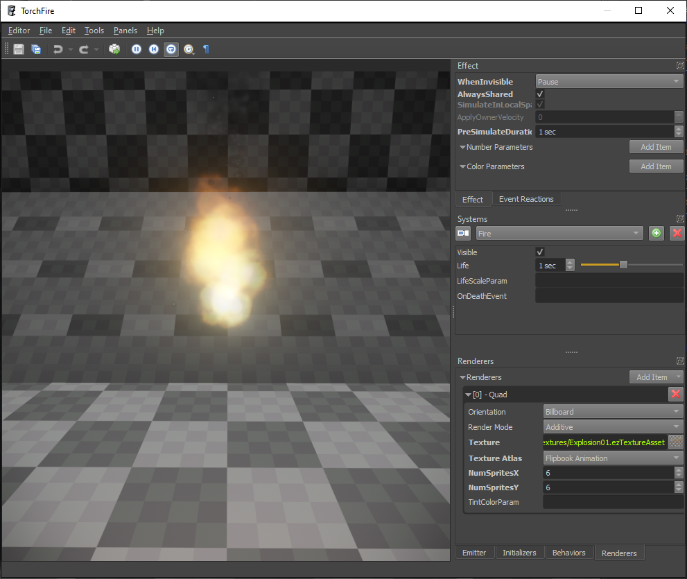

# Particle Effects

<!-- PAGE IS TODO -->

Particle effects are used to create the visual part of things like explosions, smoke, fire, water splashes and much more. They are randomized to have slight variations every time. To create a full effect, like an explosion, with sound and physical properties such as pushing nearby objects away or damaging objects and creatures, a particle effect is typically put into a [prefab (TODO)](../../prefabs/prefabs-overview.md), which contains additional components for [sound (TODO)](../../sound/fmod.md) and game play logic (e.g. through [scripts (TODO)](../../custom-code/typescript/typescript-overview.md)).

To create a new particle effect, use *Editor > Create Document* and select *Particle Effect* as the file type. Or alternatively, right-click on any asset in the [asset browser (TODO)](../../assets/asset-browser.md) and select *New > Particle Effect*.

This is an overview screenshot of the particle editor:

The 3D viewport plays the effect in a loop. Using the toolbar buttons you can pause, reset, slow down or speed up the playback. On the right hand side there are multiple tabs which hold the various settings of the effect. If you are not too familiar with particle effects yet, please read [how particle effects work](how-particle-effects-work.md).

## See Also

* [Back to Index](../../index.md)
