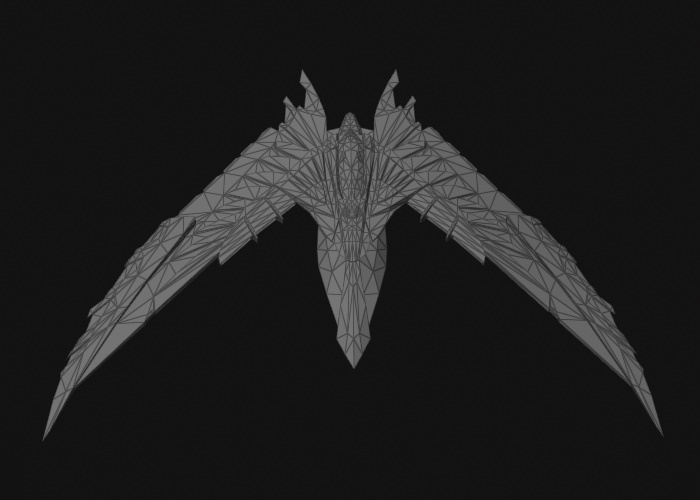
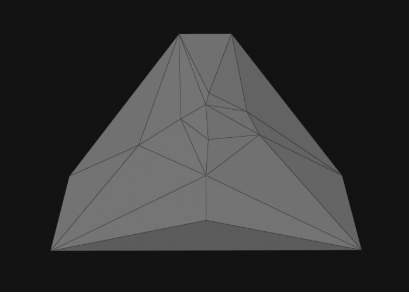

# Collision Meshes

Collision meshes are special [meshes (TODO)](../graphics/meshes-overview.md) that are used by the physics engine to compute physical interactions. Their internal representation is optimized to speed up this task. Additionally, physics engines generally distinguish between two types of meshes: *convex* meshes and *concave* meshes. While concave meshes can represent any arbitrary geometric shape, they can only be used for static [physics actors (TODO)](actors.md), which limits them to be used for the static level geometry. Convex meshes are often an oversimplification of the original mesh. However, they can be used for all physical interactions.

## Concave Collision Meshes

To create a concave collision mesh, use the asset type *Collision Mesh* (`ezCollisionMeshAsset`) when [importing an asset](../assets/import-assets.md).

The image above shows a mesh imported as a concave collision mesh. As you can see it represents every detail faithfully. Due to this complexity, the model can only be used for static [physics actors (TODO)](actors.md), meaning you can place it in a level, scale and rotate it, but you may not move it dynamically during the game and it cannot be used to simulate a rigid body. The complexity of a mesh has a direct impact on the performance of the game. Especially small details may result in larger computational costs when dynamic objects collide with those detailed areas. If you want to optimize performance, you should author dedicated collision meshes with reduced complexity, instead of using the render mesh directly.

Concave collision meshes are set directly on the [static physics actor (TODO)](actors.md) component and have no dedicated [physics shape (TODO)](shapes.md) component.

## Convex Collision Meshes

To create a convex collision mesh, use the asset type *Collision Mesh (Convex)* (`ezConvexCollisionMeshAsset`) when [importing an asset](../assets/import-assets.md).

The image above shows the same mesh imported as a convex collision mesh. Here the asset transformation computed the *convex hull* of the input data and reduced that to less than 250 triangles (a requirement by PhysX). Obviously, the mesh lost all of its details. This collision mesh can now be used for all kinds of physics computations, including dynamic [physics actors (TODO)](actors.md) for rigid body simulation. Of course the object will not collide with its surroundings according to its actual geometry, but in many use cases that won't be obvious.

To attach a convex mesh to a dynamic physics actor, use the *Convex Mesh Shape* component (`ezPxShapeConvexComponent`) as a dedicated [physics shape (TODO)](shapes.md). Of course convex meshes may also be used directly by [static physics actor (TODO)](actors.md) components.

## Visualizing Collision Meshes

Sometimes you want to visualize the collision mesh of an object within a scene. The most powerful way to look at physics objects is to use the [PhysX Visual Debugger (TODO)](visual-debugger.md). However, for some use cases you can also just attach a *Collision Mesh Visualization* component (`ezPxVisColMeshComponent`). This renders the collision mesh into your scene the same way as in the images above.

## See Also

* [Back to Index](../index.md)
* [PhysX Integration (TODO)](physx-overview.md)
* [Physics Shapes (TODO)](shapes.md)
* [Physics Actors (TODO)](actors.md)
* [Collision Layers](collision-layers.md)
* [PhysX Visual Debugger (TODO)](visual-debugger.md)
