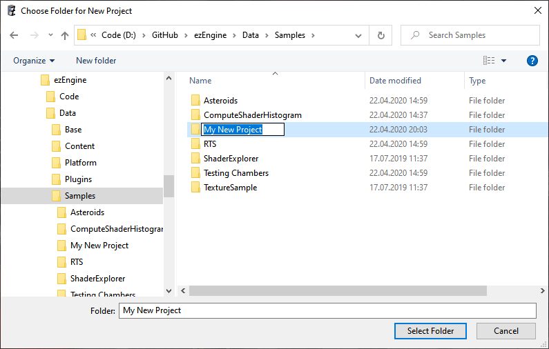
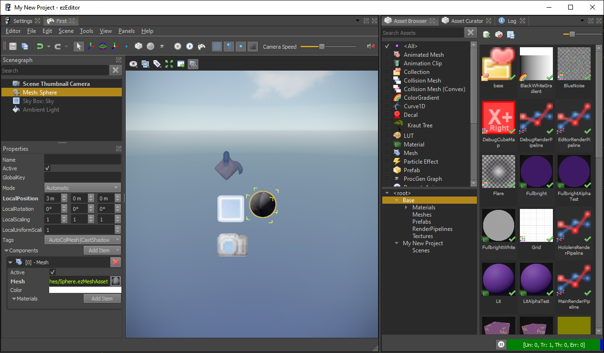

# Projects

The term *project* refers to one game or application, its global settings, and all its data. The editor distinguishes between projects, and allows you to configure various options of each one. On the runtime side, however, the concept of a project does not exist, the current state of the runtime represents the project. Therefore, when you switch to a different project in the editor, the engine will in fact be shut down completely and restarted with different settings (editor and engine are two separate processes).

## Creating a Project

You can use ezEngine entirely without the editor. In that case, you do not need to create a project, at all. Your [application (TODO)](../runtime/application/application.md) is your project and you set up things like the [fileSystem](../runtime/filesystem.md), the [plugins (TODO)](../custom-code/cpp/engine-plugins.md) and so on, entirely from code.

It is more convenient, though, to maintain your project through the editor. To create a new project, open the editor and select *Editor > Create Project...*.

The dialog will ask you to select a **new folder** for your project:

The name of the folder represents the name of your project. This name is stored nowhere else, you can rename your project later simply by renaming the folder.

### Basic Setup

Now you have a new, blank project. The first thing you should do is to check the [project settings](project-settings.md). Specifically, if you want to share assets between multiple projects, you need to put those assets into a dedicated folder and then add that folder to your project as a [data directory](data-directories.md).

The second thing you should check is which [engine plugins](project-settings.md#engine-plugins) you want to use. This is not critical at this point, but if you start using features from some plugin (e.g. [PhysX (TODO)](../physics/physx-overview.md)) and then try to [run a scene standalone](../editor/run-scene.md), it won't work.

The following engine plugins are useful to enable for most projects:

* **ezParticlePlugin** - for [particle effects](../effects/particle-effects/particle-effects-overview.md)
* **ezTypeScriptPlugin** - for [scripting with TypeScript (TODO)](../custom-code/typescript/typescript-overview.md)
* **ezPhysXPlugin** - for physics with [PhysX (TODO)](../physics/physx-overview.md)
* **ezFmodPlugin** - for sound with [FMOD (TODO)](../sound/fmod-overview.md) (requires that you have [Fmod support](../build/build-prerequisites.md) enabled)

If you don't use a particular feature in your project, you can of course keep the respective plugin deactivated.

### Create a Scene

Select *Editor > Create Document...* and create a [document (TODO)](../editor/editor-documents.md) of type `ezScene`. The new scene will be filled with some default objects and you should see something like this:

If you don't see the [asset browser](../assets/asset-browser.md), make sure to open it. You can now [edit your scene](../scenes/scene-editing.md). When you need more assets to play with, you need to [import them](../assets/import-assets.md) into your project. Once you have something in your scene that could *do something*, you can [test your scene](../editor/run-scene.md). A good starting point for that is to simply attach a `Rotor` component to a mesh. A fun next step is to let objects fall down using [PhysX (TODO)](../physics/physx-overview.md) (hint: you need a `Dynamic Actor` component and a `Box Shape` component)

## Project-wide options

Plugins may add project wide options. Not all options may be exposed through editor UI, there are a few things that can (at the moment) only be configured through config files or directly from code. Most options are stored in [OpenDDL](https://openddl.org/) format or other human-readable files, and you can edit them directly. Some options to be aware of are:

* [Data directories](data-directories.md)
* [Engine plugins (TODO)](../custom-code/cpp/engine-plugins.md)
* [Collision layers](../physics/collision-layers.md)
* [Input Configuration](project-settings.md#input-configuration)
* [Tags](tags.md)
* [Window Configuration](project-settings.md#window-configuration)
* [Asset profiles (TODO)](../assets/asset-profiles.md)

## See Also

* [Back to Index](../index.md)
