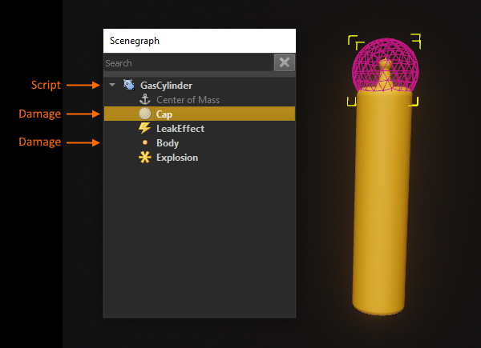
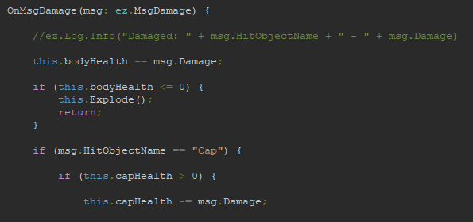

# Messaging

For an introduction what a message is and how it fits into the overall picture, see [The World / Scenegraph System](world-overview.md).

This documentation focuses on the C++ `ezMessage` class. The functionality exposed through other mechanisms, such as [TypeScript (TODO)](../../custom-code/typescript/typescript-overview.md), may be more limited in scope, but ultimately maps to the C++ implementation.

Messages can be sent from any code. They can only be received by [components](components.md), though, as the messaging system is implemented by `ezWorld`.

## Declaring a Message

A message has to be derived from `ezMessage` and contain a helper macro that implements some message specific functionality:

<!-- BEGIN-DOCS-CODE-SNIPPET: message-decl -->
```cpp
struct ezMsgSetText : public ezMessage
{
  EZ_DECLARE_MESSAGE_TYPE(ezMsgSetText, ezMessage);

  ezString m_sText;
};
```
<!-- END-DOCS-CODE-SNIPPET -->

In some cpp file you then also need to implement the message and set up basic [reflection information](../reflection-system.md):

<!-- BEGIN-DOCS-CODE-SNIPPET: message-impl -->
```cpp
EZ_IMPLEMENT_MESSAGE_TYPE(ezMsgSetText);
EZ_BEGIN_DYNAMIC_REFLECTED_TYPE(ezMsgSetText, 1, ezRTTIDefaultAllocator<ezMsgSetText>)
EZ_END_DYNAMIC_REFLECTED_TYPE;
```
<!-- END-DOCS-CODE-SNIPPET -->

This is all that is needed to send and receive the message in C++ code.

> **Note:** The code above does not add reflection for each message member, as that is not necessary to make this message work. However, if you want to send and receive this message from non-C++ code, for example from [TypeScript (TODO)](../../custom-code/typescript/typescript-overview.md), then reflecting the members is necessary for the language binding to work. Be aware though, that language bindings may not support all types of reflected members and would ignore those.

## Message Handlers

For each message type that your component is supposed to receive, you need to add a function that takes the respective component types as the only argument:

<!-- BEGIN-DOCS-CODE-SNIPPET: message-handler-impl -->
```cpp
void DisplayMsgComponent::OnSetText(ezMsgSetText& msg)
{
  m_sCurrentText = msg.m_sText;
}

void DisplayMsgComponent::OnSetColor(ezMsgSetColor& msg)
{
  m_TextColor = msg.m_Color;
}
```
<!-- END-DOCS-CODE-SNIPPET -->

Finally, you also need to register these functions as message handlers, in the component's reflection information:

<!-- BEGIN-DOCS-CODE-SNIPPET: message-handler-block -->
```cpp
EZ_BEGIN_MESSAGEHANDLERS
{
  EZ_MESSAGE_HANDLER(ezMsgSetText, OnSetText),
  EZ_MESSAGE_HANDLER(ezMsgSetColor, OnSetColor)
}
EZ_END_MESSAGEHANDLERS;
```
<!-- END-DOCS-CODE-SNIPPET -->

Now this component is ready to receive messages of those types.

## Sending Messages

To send a message, first create an instance on the stack (don't heap allocate them) and then call one of the `SendMessage()` functions:

<!-- BEGIN-DOCS-CODE-SNIPPET: message-send-direct -->
```cpp
ezMsgSetText textMsg;
textMsg.m_sText = m_TextArray[idx];
pGameObject->SendMessageRecursive(textMsg);
```
<!-- END-DOCS-CODE-SNIPPET -->

### Message Routing

There are several ways a message can be sent. Which function you use determines which components may see the message and also how efficient the delivery will be.

You can send functions either through an `ezGameObject`, through an `ezComponent` or through an `ezWorld`. It is differentiated between *sending* a message (direct) and *posting* a message (delayed).

* Messages sent through functions on `ezComponent` will always only be received by exactly that component and no one else.
* Messages sent through `ezGameObject` are broadcast to all components on that object. If one of the `Recursive` variants is used, the messages are additionally delivered to all components on all child objects.
* When sending messages through `ezWorld`, you identify the target through a handle (`ezGameObjectHandle` or `ezComponentHandle`). In this case the world takes care of resolving the handle for you. If the target object does not exist anymore, the message won't be handled by anyone.

If you call `SendMessage()`, the message is delivered **immediately**. That also means that all message handlers will access the same message object. This can be used to query information, as the message handler can write data back to the message. If the message is meant to be sent to multiple receivers, the code must take care to properly append or aggregate the results. Messages are never delivered multi-threaded, though.

If you call `PostMessage()`, the message is delivered **delayed**. These messages are queued and delivered when their time has come. If the target does not exist anymore at that time, the message is discarded with no effect. Posted messages can't be used to retrieve a result. Internally, posted messages will be copied, so you still don't need to allocate them on the heap.
Apart from a time delay, when posting a message you also have to specify a *phase* in which to deliver the message (see `ezObjectMsgQueueType`). This is used for special cases, where you want to tightly control at what time during the world update the message should arrive. For most cases using `ezObjectMsgQueueType::NextFrame` is the right choice.

## Event Messages

Event messages are a special type of message with a different kind of semantic. Regular messages are used to 'instruct' components to do something. For example to switch something on, or to apply a physical force to it. These things can be implemented differently by different component types, but generally the calling code assumes them to do something. When messages are *broadcast* (instead of sending them to a single component directly), *all* targeted components get the message.

*Event messages* on the other hand, are used to 'inform' an object hierarchy that *something happened*. An example would be `ezMsgDamage` which is used to inform an object that it received damage. For these kind of messages you only want *one* component to handle it. This will often be a very high-level component like a custom component representing the player or an NPC.

These types of components are typically attached to the very top of a [prefab](../../prefabs/prefabs-overview.md) structure and they are supposed to manage the overall game logic for this object. Therefore the *message routing* for event messages follows a different pattern: when you call `ezGameObject::SendEventMessage()` on a node, the message is delivered to the closest **parent node** that has a component of type `ezEventMessageHandlerComponent`.

The `ezEventMessageHandlerComponent` interface is only implemented by very few component types. Out of the box, only by `ezTypeScriptComponent` and `ezVisualScriptComponent`, meaning only components used to provide scripting functionality are currently capable of handling event messages. However, if you were to write your own NPC class, that is supposed to implement actual game logic (and not just path finding), then it makes sense to make it an `ezEventMessageHandlerComponent`.

Note that once an `ezEventMessageHandlerComponent` is attached to a node, it will receive *all* event messages below that node hierarchy, no matter whether it has a message handler for it or not. It therefore prevents event messages from leaving the hierarchy by default. If an event message is supposed to 'bubble up' further, the message handler component must forward the message manually.

### Example: Gas Cylinder

This prefab has two physics shapes. One for the body, one for the cap. If the body receives too much damage, the cylinder is supposed to explode. If the cap receives enough damage, the cylinder is supposed to start ventilating burning gas, fly off and explode after a while.



To implement this, we attach a script component to the very top of the hierarchy. The script contains a message handler for `ezMsgDamage`. When a [projectile (TODO)](../../gameplay/projectile-component.md) hits the cylinder, it calls `ezGameObject::SendEventMessage()` on the node whose [physics shape (TODO)](../../physics/shapes.md) it hit. The event message contains the information through which game object and which component it was sent.

The message is then delivered to the closest parent node that handles event messages, which in this case is the `GasCylinder` node, because it has the script attached. The script can then differentiate what child node was hit and implement the desired game logic:



### Declaring Event Messages

The only difference between regular messages and event messages is, that event messages must be derived from `ezEventMessage`.

### Sending Event Messages

You can send event messages to every object using `ezGameObject::SendEventMessage()`. This will determine the closest parent to handle events on the fly and deliver the message accordingly.

For components that regularly raise events to the same object hierarchy (their own), such as trigger components, it is more efficient to have a member of type `ezEventMessageSender<>`. Sending a message through this object will cache the receiving target and be more efficient the second time.

If a component that is an `ezEventMessageHandlerComponent` itself wants to send an event message further up the hierarchy, it has to send the event to its own parent node.

> **Caution:** Event messages are also just regular messages and *can* be sent that way using `SendMessage()` or `PostMessage()`. If you accidentally use those functions, rather than `SendEventMessage()` or `PostEventMessage()`, your message will not get delivered as intended.

### Global Event Message Handlers

If an event is sent to a hierarchy that has no event handler component, it is ultimately delivered to a *global event handler*. A global event handler is simply a component that has the `HandleGlobalEvents` property enabled.

A global event handler can be useful as a catch-all level scripts. This way you can place buttons around a level, and have a single script that receives the message when one of them is pressed. Each button has its own script to implement its logic (when you can press it, how it changes its appearance and so on), but the button script then just raises a generic "button pressed" event on its own parent node. If those buttons don't have an event handling parent node, the message is delivered to the level script, which can then handle the logic of all those buttons.

Be careful though when using multiple global event handler components. Every type of message is only delivered to a single handler, so as long as each global handler takes care of a different type, it will work as expected.

## Message Serialization

For regular messages you don't need to implement any serialization, as they are short lived within the same process. However, if you intend to record messages or send them across a network, you can utilize `ezMessage::PackageForTransfer()` and `ezMessage::ReplicatePackedMessage()`. To make these functions work, you need to override and implement `ezMessage::Serialize()` and `ezMessage::Deserialize()`.

## See Also

* [Back to Index](../../index.md)
* [The World / Scenegraph System](world-overview.md)
* [Sample Game Plugin](../../samples/sample-game-plugin.md)